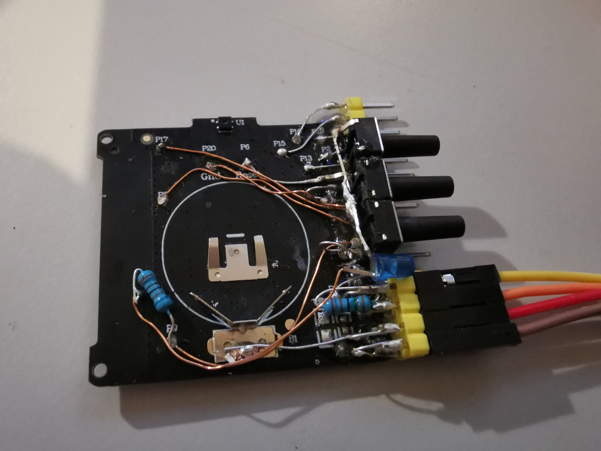
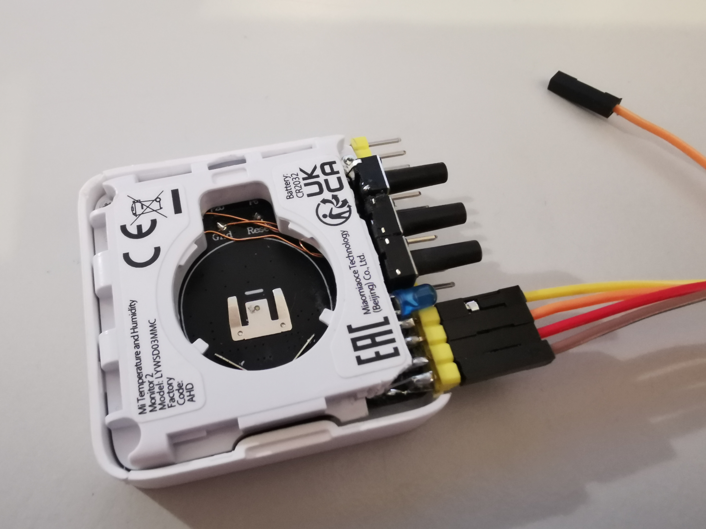

# my devboard

## pinout
| header pin | test pin | mcu pin | function | alt func. |
| --- | --- | --- | --- | --- |
| A1  | P16 |     |     |    |
| A2  | P15 | PC3 | I2C_SCK | PWM1/UART_RX/I2C_SCK/XC32K_I/PGA_N1 |
| A3  | P18 |     |     |   |
| A4  | P2  |     |     |   |
| A5  | P13 | PC2 | I2C_SDA | PWM0/7816_TRX(UART_TX)/I2C_SDA/XC32K_O/PGA_P1 |
| A6  | RST | PA5 | SW1 | DM |
| A7  | P7  | PD7 | SW2 | SPI_CK/I2S_BCK/7816_TRX(UART_TX) |
| A8  | P17 |     |     |  |
| A9  | P3  |     |     |  |
| A10 | P9  | PC4 | LED | PWM2/UART_CTS/PWM0_N/sar_aio<8> |
| A11 | P8  | PA6 | SW3 | DP(SWS) |
| A12 | P5  |     |     |  |
| v13 | P14 | PA7 | SWS | SWS/UART_RTS |
| A14 | P10 | PB6 | ?   | SDM_P1/SPI_DI/UART_RTS/lc_comp_ain<6>/sar_aio<6> |
| A15 | 3V3 | 3V3 |     |  |
| A16 | GND | GND |     |  |
|    | B1  | PB7 |     | SDM_N1/SPI_DO/UART_RX/lc_comp_ain<7>/sar_aio<7> |

| header pin | test pin | PROGRAMMER |
| --- | --- | --- |
| B1 | P14 | RX |
| B2 | P14 (over 1k2) | TX |
| B3 | 3V3 | 3V3 |
| B4 | GND | GND |

